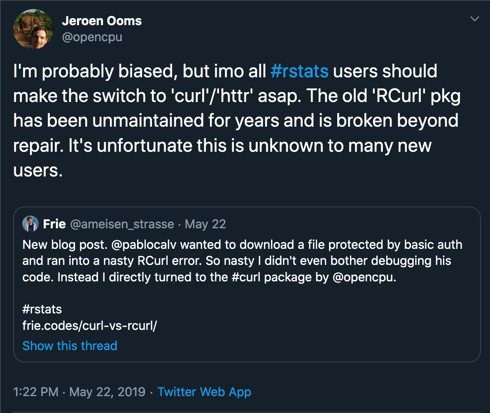

class: inverse, center, middle

# Welcome

---

# Objectives

--
* Learn how to work with `httr`, `curl`, and `jsonlite` to consume data from APIs

--
* Learn how to use some packages from the [cloudyr](http://cloudyr.github.io/) project to create resources in the cloud and use services to augment your data

-- 
* Learn how to transform your R code into an API you can serve using `plumber`

---
class: inverse, center, middle

# GitHub Repo

[https://github.com/wahalulu/odsc-east-2020](https://github.com/wahalulu/odsc-east-2020)

---


# About

* Sr. Cloud Solutions Architect, Microsoft Data & AI
* Adjunct professor at Georgetown and GWU
* Co-founder of DataCommunityDC
* R Fanatic

---

class: inverse, center, middle

# Primer on APIs

---

# What is an API?

API: Application Programming Interface

APIs allow software programs to communicate with each other. One program can call another program’s API to get access to data or functionality of the other program.

An API is an interface exposed by some software. It's an abstraction of the underlying implementation (code, architecture, etc.)

---

# Web (Remote) APIs - our focus today

* Communicate over the Internet
* Many are open, many require authentication
* HTTP protocol
* REST architecture

---

# RESTful APIs - the vast majority

REST: Representational State Transfer

* Client/server separation
* Statelessness 
* Cacheability
* Layered system
* Code on demand
* Uniform interface

---
background-image: url(images/rest-api-basics.png)
background-size: contain

.footnote[Figure from the book _The Design of Everyday APIs_ by Arnand Lauret, 2019, Manning]

---
background-image: url(images/http-method.png)
background-size: contain

.footnote[Figure from the book _The Design of Everyday APIs_ by Arnand Lauret, 2019, Manning]

---

background-image: url(images/rest-api-call.png)
background-size: contain

.footnote[Figure from the book _The Design of Everyday APIs_ by Arnand Lauret, 2019, Manning]

---

background-image: url(images/rest-call-anatomy.png)
background-size: contain

.footnote[https://www.slideshare.net/sharepointbits/understanding-and-programming-the-sharepoint-rest-api]

---

background-image: url(images/images/JSONSample.jpg)
background-size: contain

.footnote[https://www.slideshare.net/sharepointbits/understanding-and-programming-the-sharepoint-rest-api]

---

background-image: url(images/wahalulu-github-1.png)
background-size: contain


---

# Open GET call with curl

```{bash, echo = TRUE, eval = FALSE}
(base) ➜  ~ curl https://api.github.com/users/wahalulu
{
  "login": "wahalulu",
  "id": 250055,
  "node_id": "MDQ6VXNlcjI1MDA1NQ==",
  "avatar_url": "https://avatars2.githubusercontent.com/u/250055?v=4",
  "gravatar_id": "",
  ...
  "name": "Marck Vaisman",
  "company": "@Microsoft ",
  "blog": "",
  "location": "Washington, DC",
  "email": null,
  "hireable": null,
  "bio": "Data & AI Specialist at Microsoft. Data Scientist, master munger. R Programmer & Advocate. Professor at Georgetown and GWU. Co-Founder @datacommunitydc ",
  ...
}
```

---

# Open GET with curl and headers

```{bash, echo = TRUE, eval = FALSE}
(base) ➜  ~ curl -i https://api.github.com/users/wahalulu
HTTP/1.1 200 OK
Date: Thu, 07 Nov 2019 20:19:02 GMT
Content-Type: application/json; charset=utf-8
Content-Length: 1443
...
X-GitHub-Request-Id: C701:1411F:10AE3439:140673AE:5DC47C36

{
  "login": "wahalulu",
  "id": 250055,
  ...
  "created_at": "2010-04-22T17:34:29Z",
  "updated_at": "2019-10-28T20:34:56Z"
}
```

---

background-image: url(images/popular-mechanics-404.png)
background-size: contain

---

# Authenticated POST

```{bash, echo = TRUE, eval = FALSE}
(base) ➜  ~ curl -X POST -u wahalulu:xxxxxxxxxxxxxxxxxxxxxxxxxxxxxxxxxxxxxxxx \
https://api.github.com/user/repos -d "{\"name\":\"dcr-repo-created-by-curl\"}"
{
  "id": 220453725,
  "node_id": "MDEwOlJlcG9zaXRvcnkyMjA0NTM3MjU=",
  "name": "dcr-repo-created-by-curl",
  "full_name": "wahalulu/dcr-repo-created-by-curl",
  "private": false,
  "owner": {
    "login": "wahalulu",
    "id": 250055,
    ...
  },
  "html_url": "https://github.com/wahalulu/dcr-repo-created-by-curl",
  "description": null,
...
}
```

---

background-image: url(images/wahalulu-github-2.png)
background-size: contain

---

class: inverse, center, middle

# R and APIs

---

# R Packages for working with APIs

--

httr

Useful tools for working with HTTP organised by HTTP verbs (GET(), POST(), etc). Configuration functions make it easy to control additional request components (authenticate(), add_headers() and so on).

--

curl

The curl package provides bindings to the libcurl C library for R. The package supports retrieving data in-memory, downloading to disk, or streaming using the R “connection” interface. Some knowledge of curl is recommended to use this package. **For a more user-friendly HTTP client, have a look at the httr package which builds on curl with HTTP specific tools and logic.**

--

jsonlite

A fast JSON parser and generator optimized for statistical data and the web. 


---

# RCurl is outdated

<div align="center">

</div>

---

# httr call

command line curl

```{bash, echo = TRUE, eval = FALSE}
(base) ➜  ~ curl -X POST -u wahalulu:xxxxxxxxxxxxxxxxxxxxxxxxxxxxxxxxxxxxxxxx \
https://api.github.com/user/repos -d "{\"name\":\"dcr-repo-created-by-curl\"}"
```

httr

```{r, echo=TRUE, eval = FALSE}
endpoint <- "https://api.github.com/user/repos"
user <- "wahalulu"
personal_token <- "xxxxxxxxxxxxxxxxxxxxxxxxxxxxxxxxxxxxxxxx"

body_httr <- list(name = "dcr-repo-created-by-httr")

create_repo <- POST(endpoint, 
                    authenticate(user, personal_token),
                    body = body_httr,
                    encode = "json")
```

---

# httr response

```{r, echo = TRUE, eval = FALSE, comment = '#'}
> create_repo$status_code
[1] 201
> create_repo$content
   [1] 7b 0a 20 20 22 69 64 22 3a 20 32 32 30 34 39 38 39 31 39 2c 0a 20 20 22 6e 6f 64 65 5f
  [30] 69 64 22 3a 20 22 4d 44 45 77 4f 6c 4a 6c 63 47 39 7a 61 58 52 76 63 6e 6b 79 4d 6a 41

# raw json
content(create_repo, "text")

# [1] "{\n  \"id\": 220498919,\n  \"node_id\": \"MDEwOlJlcG9zaXRvcnkyMjA0OTg5MTk=\",\n
# \"name\": \"dcr-repo-created-by-httr\",\n  \"full_name\":
# \"wahalulu/dcr-repo-created-by-httr\",\n  \"private\": false,\n  \"owner\": {\n

# list
content(create_repo)
$id
[1] 220498919
```

---

background-image: url(images/wahalulu-github-3.png)
background-size: contain


---
background-image: url(images/burns.png)
background-size: contain

---

# ugly

```{r, echo=TRUE, eval = FALSE}
# Code from Marck Vaisman's meetupr package circa 2014: https://github.com/wahalulu/meetupr
extract_result_dataframe <- function(l) {
  if(!is.list(l)) stop("Object must be a list of responses!")
  df_list <- lapply(l, function(x) {
    if(identical(fromJSON(content(x, "text"))$results, list())) {
      NULL
    } else {
      flatten(fromJSON(content(x, "text"))$results)
    }
  })
  bind_rows(df_list)
}
```

---

# elegant

```{r, echo=TRUE, eval = FALSE}
# Code from RLadies meetupr package 2019: https://github.com/rladies/meetupr
get_members <- function(urlname, api_key = NULL){
  api_method <- paste0(urlname, "/members/")
  res <- .fetch_results(api_method, api_key)
  tibble::tibble(
    id = purrr::map_int(res, "id"),
    name = purrr::map_chr(res, "name", .default = NA),
    bio = purrr::map_chr(res, "bio", .default = NA),
    status = purrr::map_chr(res, "status"),
    joined = .date_helper(purrr::map_dbl(res, "joined")),
    city = purrr::map_chr(res, "city", .default = NA),
    country = purrr::map_chr(res, "country", .default = NA),
    state = purrr::map_chr(res, "state", .default = NA),
    lat = purrr::map_dbl(res, "lat", .default = NA),
    lon = purrr::map_dbl(res, "lon", .default = NA),
    photo_link = purrr::map_chr(res, c("photo", "photo_link"), .default = NA),
    resource = res
  )
}
```

---
class: inverse, center, middle

# Managing your cloud

---

background-image: url(images/azure-portal.png)
background-size: contain

---

# Programatically

* Command Line Tools (usually wrapper around API)
* SDKs/Libraries (usually wrapper around API, and may not be availble in R) 
* REST APIs

---

background-image: url(images/cloudyr.png)
background-size: contain


---

background-image: url(images/azurer.png)
background-size: contain

---
background-image: url(images/azurer-first.png)
background-size: contain

---
background-image: url(images/azurer-second.png)
background-size: contain


---
background-image: url(images/r-dev-guide.png)
background-size: contain

---
class: inverse, center, middle

# Demo: Connecting to and creating resources on Azure with R

---
class: inverse, center, middle

# Demo: Using Azure Cognitive Services from R

---
background-image: url(images/azure-ml-r-sdk.png)
background-size: contain

---
background-image: url(images/thats-all-folks.png)
background-size: cover


