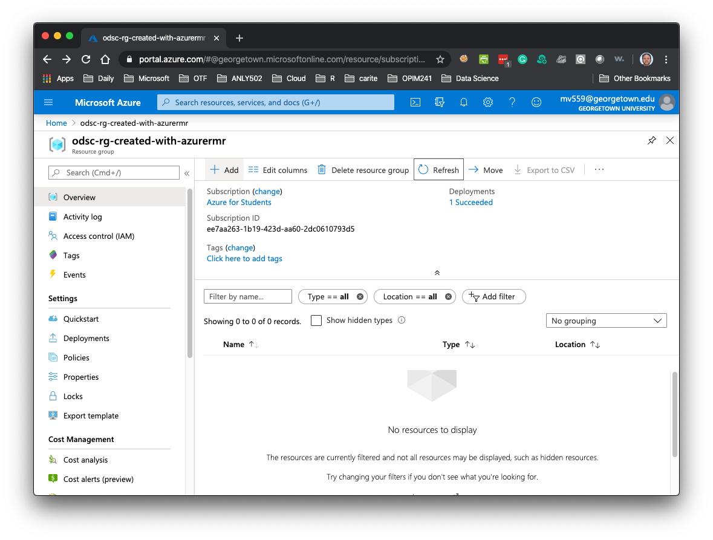
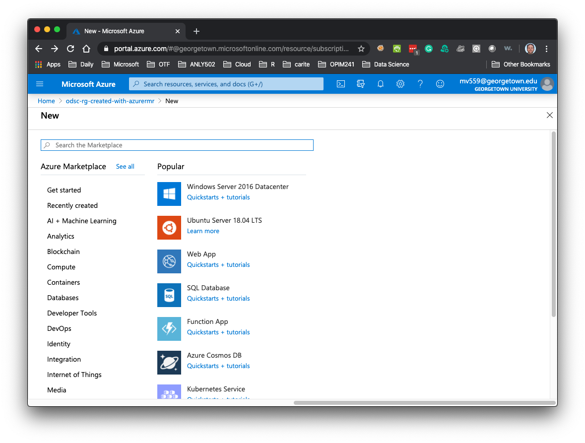
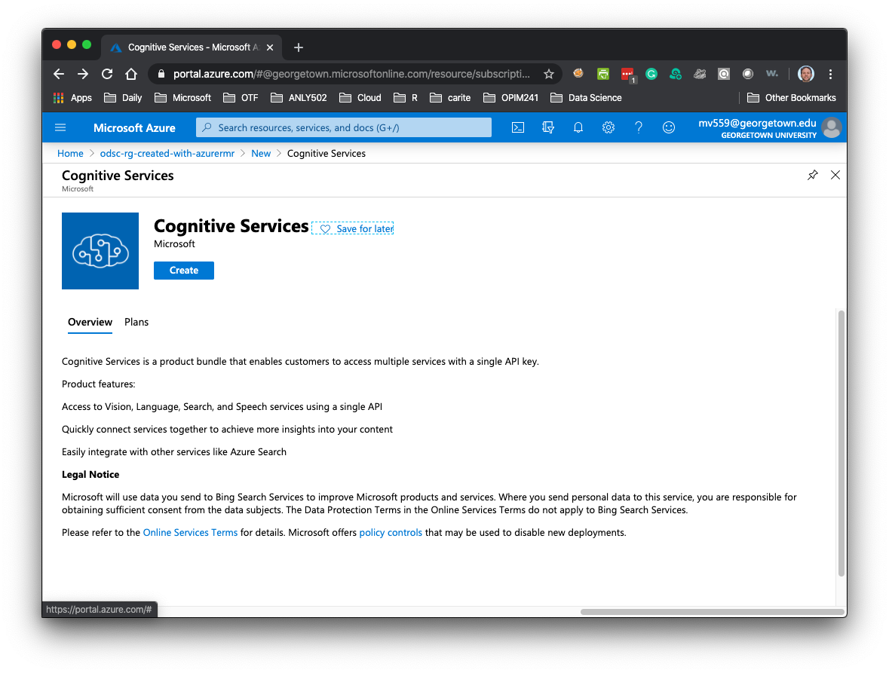
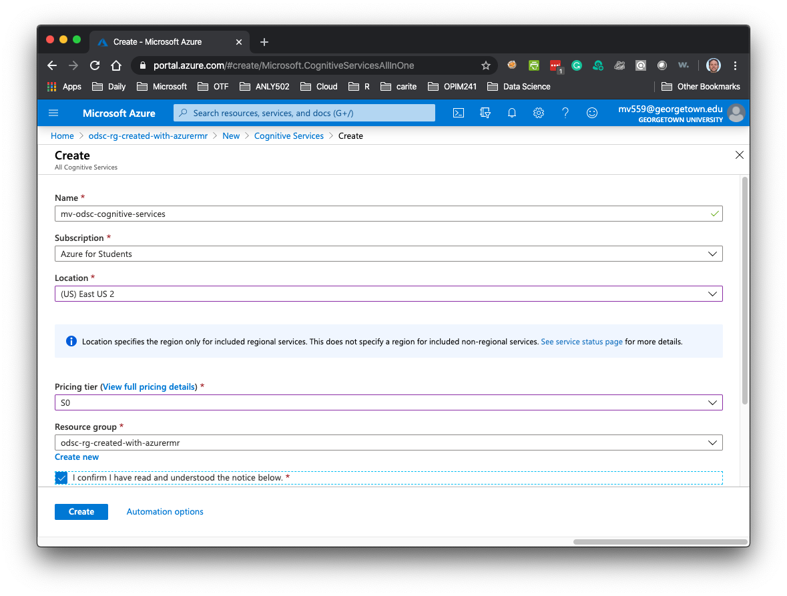
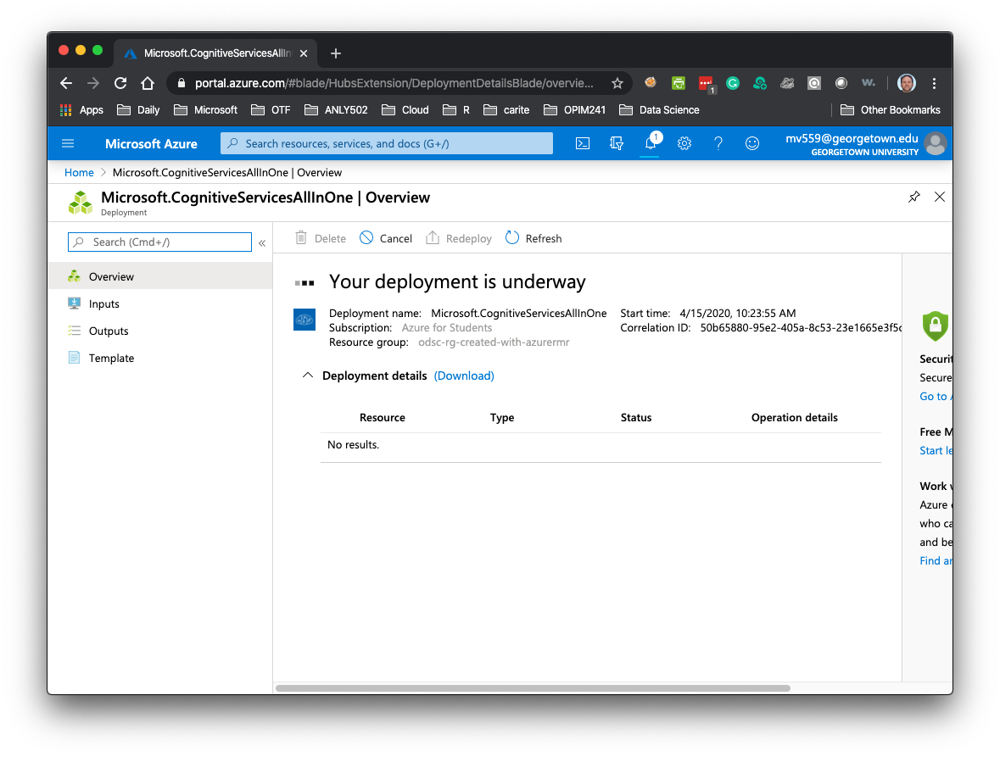
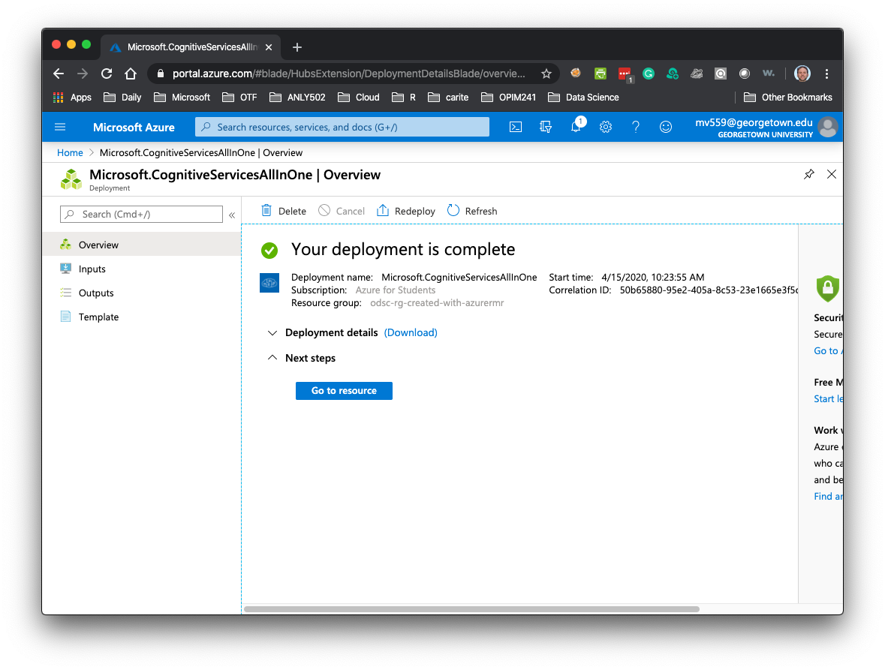
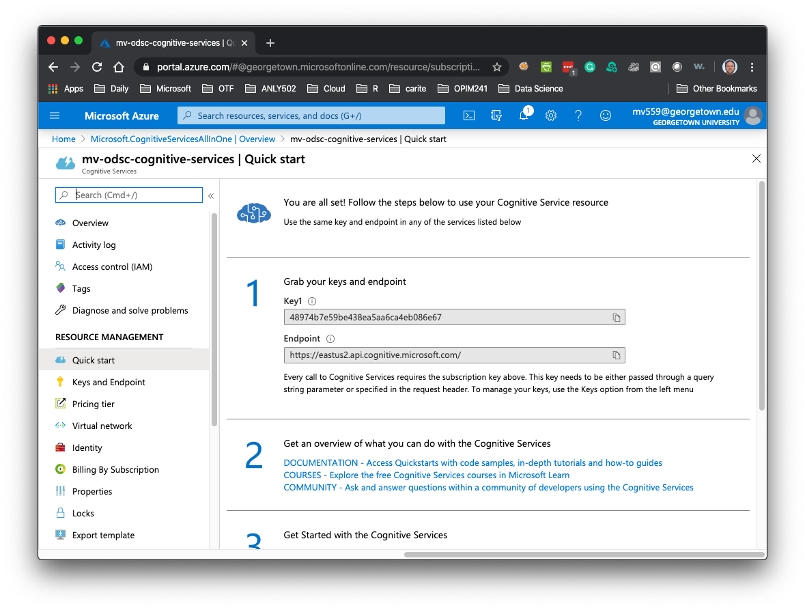

# Create your Cognitive Services

1. Login to your Azure account, go to _Resource Groups_. You should see the one you created with R. Click on it.

	

1. Click +Add

	

1. Start typing _Cognitive Services_ in the box until it shows up, click on it

	

1. Click _Create_

	

1. Give the service a name, it must be globally unique. I suggest something like `odsc-xxxyyyy-rg-created-with-R` where `xxx` are your initials, and `yyyy` is your year of birth. Hopefully these will be unique enough.
2. Select "EastUS2" as Location 
3. Select S0 as pricing tier
4. Select your resource group
5. Check on "I Confirm..."
6. Click Create

	

1. Wait...

	

1. Once your deployment is complete, click on _Go To Resource_

	

1. Copy the key and endpoint from this page. You will need it in R.

	
	

